# 🧠 The Brain of the Backend: Databases & The Magic of ORMs

Welcome back, backend traveler! 🚀

So far, we've talked about the **Server** as the brain of your application. But here’s the catch: a brain without memory is... well, just a calculator. It can process things, but it forgets them the moment you turn it off. 🕯️

To build a real app—one that remembers who your users are, who they’re friends with, and what memes they liked—you need a **Database**.

---

## 🏗️ The Foundation: SQL vs. NoSQL

In the land of data, there are two main tribes.

### 1. SQL (The Strict Architect) 📐
relational databases (like **PostgreSQL** or **MySQL**) are the strict project managers of the data world.
*   **Structure is King:** Everything lives in **Tables** (think Excel sheets on steroids).
*   **Relationships Matter:** You can’t just add a "friend" without ensuring that "friend" actually exists.
*   **The Vibe:** "Fill out this form in triplicate, and don't you dare miss a field."

### 2. NoSQL (The Free Spirit) 🎨
Non-relational databases (like **MongoDB**) are the jazz musicians.
*   **Flexibility is Key:** Store data as **Documents** (JSON-like objects).
*   **No Rules:** Want to add a random field to just *one* user? Go ahead!
*   **The Vibe:** "Just throw it in the bag; we'll figure it out later."

### 📊 Visualizing the Difference


> **Industry Secret:** While NoSQL is fun and flexible, **SQL (specifically PostgreSQL)** is the industry standard for 90% of serious applications. Why? Because data integrity allows you to sleep at night. 😴

---

## 🗣️ The Communication Breakdown

Here is the problem:
*   Your Code (JavaScript/Python) speaks in **Objects** and **Functions**.
*   Your Database (SQL) speaks in **Tables** and **Queries**.

It's like trying to order a pizza in Italy when you only speak Klingon. 🖖🇮🇹

**Without help, you have to write raw SQL queries inside your JavaScript:**
```javascript
// 😨 The Dark Ages
const query = "INSERT INTO users (name, email) VALUES ('" + name + "', '" + email + "');";
// One typo here, and your whole app crashes (or gets hacked).
```

---

## 🧙‍♂️ Enter the Hero: ORM (Object-Relational Mapping)

An **ORM** (like **Prisma**, **Drizzle**, or **TypeORM**) is your **Universal Translator**.

Imagine you have two people who can't communicate:
1.  **The Developer** (Blind to SQL syntax).
2.  **The Database** (Deaf to JavaScript objects).

The **ORM** sits in the middle. It listens to your JavaScript/TypeScript requests and *translates* them into perfect, optimized SQL for the database. And when the database responds with raw table rows, the ORM *translates* them back into neat JavaScript objects for you.

### 🔄 The Translation Flow

```mermaid
sequenceDiagram
    participant JS as Your Code (JS/TS)
    participant ORM as The ORM (Translator)
    participant DB as Database (SQL)

    Note over JS, DB: Task: "Create a new user named Zoya"

    JS->>ORM: db.users.create({ name: 'Zoya' })
    Note right of JS: Clean, readable Object syntax ✨

    ORM->>DB: INSERT INTO "Users" ("name") VALUES ('Zoya');
    Note right of ORM: Translates to Raw SQL 🔣

    DB-->>ORM: Success! (Row ID: 1)
    ORM-->>JS: return { id: 1, name: 'Zoya' }
```



---

## 🛠️ Why Use an ORM?

1.  **Safety First 🛡️**: ORMs automatically protect you from "SQL Injection" attacks (where hackers try to trick your database).
2.  **Productivity 🚀**: You get **TypeScript Autocomplete**. Imagine typing `user.` and seeing `email`, `id`, and `name` pop up instantly.
3.  **Sanity 🧠**: You write code in the language you know (JS/Python), not a query language from the 1970s.

### The Modern Toolkit

*   **Prisma**: The heavy hitter. Amazing autocomplete, very popular.
*   **Drizzle**: The lightweight speedster. Fast, closer to SQL, booming in popularity.
*   **Mongoose**: The standard for MongoDB (NoSQL).

---

## 🏁 The Takeaway

Databases are where your app's soul lives.
*   **SQL** gives you structure (recommended! ⭐).
*   **NoSQL** gives you freedom.
*   **ORMs** are the magical translators that let you talk to either of them without learning a new language.

Master the ORM, and you master the data! 💾✨
