# 🛡️ The Unsung Heroes of Express: Mastering Middlewares

Imagine you're running a super-exclusive club. 🕺💃

You have a **Guest** (the `Request`) wanting to enter your **VIP Lounge** (the `Route Handler`) to get a **fancy drink** (the `Response`).

But wait! You can't just let *anyone* walk straight into the VIP Lounge, right?

You need:
1.  **Security** to check their ID. 👮‍♂️
2.  **A Coat Check** to take their heavy jackets. 🧥
3.  **A Guide** to show them to their table. 💁‍♀️

In the world of Express.js, these helpful staff members are your **Middlewares**.

---

## 🚦 What Exactly is Middleware?

Technically speaking, **Middleware** is just a function that sits *in the middle* between the incoming request and your final route handler.

It has access to three magical things:
1.  **`req`**: The incoming request object (The Guest).
2.  **`res`**: The response object (The Drink/Service).
3.  **`next`**: A function to signal "I'm done, send them to the next person!" ➡️

### The Power of the Middleware ⚡
A middleware function is like a checkpoint. It can do three things:
1.  **Execute any code**: Log data, parse cookies, etc.
2.  **Modify `req` and `res`**: Add user details to the request or set headers.
3.  **End the cycle**: Send a response immediately (e.g., "Sorry, you're not on the list! 🚫").
4.  **Call `next()`**: Pass the baton to the next middleware in the stack.

---

## 🧩 Visualizing the Flow

Think of it like an assembly line. The request moves through stages. If one stage fails (errors) or doesn't pass it on, the whole line stops!

```mermaid
graph LR
    A[Client Request 🚀] --> B{Global Middleware 🌍}
    B -->|next| C{Custom Check 🕵️}
    C -->|next| D[Route Handler 🏁]
    D --> E[Server Response 📤]
    
    C -.->|Error/Block| F[Error Response 🛑]
```



---

## 🌍 Global Middlewares: The "House Rules"

**Global Middlewares** run for *every single request* that hits your server. These are perfect for things like logging (so you know who visited) or parsing JSON bodies.

You define them with `app.use()`.

```javascript
const express = require('express');
const app = express();

// 1. GLOBAL MIDDLEWARE
// This runs for EVERY request!
app.use((req, res, next) => {
    console.log(`📢 LOG: Request received for ${req.url}`);
    
    // IMPORTANT: Don't forget to call next(), or the request hangs forever! ⏳
    next(); 
});

app.get('/', (req, res) => {
    res.send('Welcome to the homepage!');
});
```

---

## 📍 Route-Specific Middlewares: The "VIP Access"

Sometimes, you only want checks for *specific* routes. For example, anyone can visit the specialized "About" page, but only admins should see the "Dashboard".

You can inject middleware specifically into a route!

```javascript
// A named middleware function (The Bouncer)
const checkAuth = (req, res, next) => {
    const password = req.query.password;
    
    if (password === 'secret123') {
        // ✅ Password correct! Proceed.
        next();
    } else {
        // ⛔ Wrong password! Terminate the cycle.
        res.status(403).send('✋ STOP! Access Denied.');
    }
};

// This route relies on the 'checkAuth' middleware
app.get('/dashboard', checkAuth, (req, res) => {
    res.send('🔓 Welcome to the Secret Dashboard!');
});

// This route is public (no middleware)
app.get('/about', (req, res) => {
    res.send('This is a public page.');
});
```

---

## 🏗️ Execution Order Matters!

Middlewares always run **in the sequence they are defined**.

If you put a Global Middleware *after* a route handler, it might never run because the route handler usually ends the cycle (by sending a response).

**Correct Order:**
1.  Global Logic (Parsers, Loggers) 🌍
2.  Route-Specific Logic (Auth) 🕵️
3.  Route Handlers (The destination) 🏁
4.  Error Handlers (The cleanup crew) 🧹

---

## 📦 Organizing Your Code (Named vs. Default Exports)

You don't want a messy `index.js` file with 50 middleware functions. Keep it clean by moving them to separate files!

**Using Named Exports:**
```javascript
// middleware/logger.js
exports.requestLogger = (req, res, next) => {
    console.log('Logging...');
    next();
};
```
*Import with:* `const { requestLogger } = require('./middleware/logger');`

**Using Module Exports (Default-ish):**
```javascript
// middleware/auth.js
module.exports = function(req, res, next) {
    // auth logic
    next();
};
```
*Import with:* `const authMiddleware = require('./middleware/auth');`

---

## 🚀 Summary

- **Middlewares** are the functions that sit between the raw request and the final response.
- They act as **Interceptors**: reading, modifying, or blocking requests.
- **Global** middlewares apply to everything; **Route** middlewares are specific.
- Always remember to call **`next()`** unless you're sending a response back!

Now go forth and protect your routes! 🛡️✨
