# 🚀 Leveling Up: From Arrays to Arrays of Hard Drives (PostgreSQL + Docker + Drizzle)

Okay, fam! 🛑 Stop what you are doing.

Remember that "database" we were using? You know, that cute little in-memory array variable `const books = []`? Yeah, it's time to say goodbye. 👋

Why? Because every time I restarted the server, **POOF!** 💨 All my books vanished. That's not a bookstore; that's a magic trick I didn't sign up for.

Today, I took the plunge. We are going **PRO**. We are talking **PostgreSQL**, **Docker**, and **Drizzle ORM**. Let's break down how I transformed my flimsy Express API into a robust, data-persisting beast! 🦁

---

## 🏗️ The Blueprint

Before we dive into code, let's look at the master plan. We aren't just installing software on my laptop; we are *containerizing* it.

```mermaid
graph TD
    subgraph "My Computer (Host)"
        Client[Client (Postman/Browser)]
        App[Express App (Node.js)]
        Driz[Drizzle ORM]
    end

    subgraph "Docker Container 🐳"
        PG[(PostgreSQL Database)]
    end

    Client -->|HTTP Request| App
    App -->|SQL Query| Driz
    Driz -->|TCP Connection :5432| PG
```

My Express app talks to Drizzle, which talks to PostgreSQL living comfortably inside a Docker container. Clean. Isolated. Beautiful. ✨

---

## 📦 Step 1: The Docker Container (Shipping the DB)

I didn't want to mess up my Windows registry installing Postgres manually. So, **Docker** to the rescue!

I spun up a `docker-compose.yml` file. Think of this as the instruction manual for the Docker ship captain.

```yaml
version: '3.8'
services:
  postgres:
    image: postgres:17.4
    ports:
      - 5432:5432  # 🔌 Plugging the container into my machine
    environment:
      POSTGRES_DB: book-store
      POSTGRES_USER: postgres
      POSTGRES_PASSWORD: mysecretpassword 🤫
```

One command `docker-compose up -d`, and boom! I have a fully functioning database server running in the background. No messy installers.

---

## 🌧️ Step 2: Drizzle ORM (The Translator)

Now, how do we talk to this database? Raw SQL? `SELECT * FROM...`? 🤢 Nah, we're modern developers. We use an **ORM** (Object-Relational Mapper).

Enter **Drizzle ORM**. 🌧️ It's like the cool translator that takes my JavaScript objects and whispers sweet SQL nothings to the database.

### The Setup (`drizzle.config.js`)
I told Drizzle where to look for my schema and where my database lives.

```javascript
import { defineConfig } from 'drizzle-kit';
export default defineConfig({
  out: './drizzle',
  schema: './models/index.js',
  dialect: 'postgresql',
  dbCredentials: {
    url: process.env.DATABASE_URL, // 🕵️ Keeping secrets safe
  },
});
```

---

## 📝 Step 3: Defining the Shape (The Schemas)

This is where it gets spicy. 🌶️ I'm not just storing simple strings anymore. I'm using **UUIDs** and **Relationships**!

I have two main tables: `Authors` and `Books`.

### The Relationship
An **Author** can write many **Books**, but a **Book** belongs to one **Author**.


### The Code (`models/authors.model.js`)

```javascript
import { pgTable, varchar, uuid } from "drizzle-orm/pg-core";

const authorsTable = pgTable('authors', {
    id: uuid().primaryKey().defaultRandom(), // Auto-generating UUIDs! 🆔
    firstName: varchar({ length: 100 }).notNull(),
    lastName: varchar({ length: 100 }),
    email: varchar({ length: 100 }).notNull().unique()
});

export default authorsTable;
```

### The Code (`models/books.model.js`)

Here is how I linked the book to the author using `references`:

```javascript
import { pgTable, varchar, uuid, text } from "drizzle-orm/pg-core";
import authorsTable from "./authors.model.js";

const booksTable = pgTable("books", {
  id: uuid().primaryKey().defaultRandom(),
  title: varchar({ length: 100 }).notNull(),
  description: text(),
  authorId: uuid().references(() => authorsTable.id).notNull() // 🔗 The Link!
});

export default booksTable;
```

---

## 🚀 Step 4: The Takeoff (Drizzle Kit & Studio)

Now for the magic. ✨

1.  **Generate**: `npx drizzle-kit generate`
    *   This looked at my code and created a SQL migration file.
2.  **Migrate**: `npx drizzle-kit migrate`
    *   This actually pushed the table creation to the running Docker database.
3.  **Studio**: `npx drizzle-kit studio`
    *   **THIS IS SO COOL.** It opened a web page (`local.drizzle.studio`) where I could see my database tables and rows like a spreadsheet! 🤯

```mermaid
sequenceDiagram
    participant Me as Me 👨‍💻
    participant Kit as Drizzle Kit 🧰
    participant DB as Postgres DB 🐘
    
    Me->>Kit: Define Schema in JS
    Kit->>DB: "Hey, create table 'books' and 'authors' please!"
    DB-->>Kit: "Done! Tables created."
    Me->>Kit: Launch Studio
    Kit-->>Me: Shows UI with Data 📊
```



---

## 🔌 Step 5: Connecting the Express App

Finally, I ripped out that old array in `index.js` and wired up the real connection.

```javascript
// db/index.js
import { drizzle } from 'drizzle-orm/node-postgres';
const db = drizzle(process.env.DATABASE_URL);
export default db;
```

Now, instead of `books.push(newBook)`, I do:

```javascript
await db.insert(booksTable).values(newBook);
```

And instead of `books.find(...)`, I do:

```javascript
// Getting all books with their authors!
await db.select().from(booksTable);
```

---

## 🎉 Conclusion

It feels *so good*.

*   **Reliable?** Yes. My data survives restarts.
*   **Scalable?** Yes. Postgres can handle millions of books.
*   **Professional?** Absolutely.

My little bookstore API just graduated from kindergarten to high school. 🎓 Time to write some data that lasts forever! 💾

**#WebDev #NodeJS #PostgreSQL #DrizzleORM #Docker #BackendJourney**
